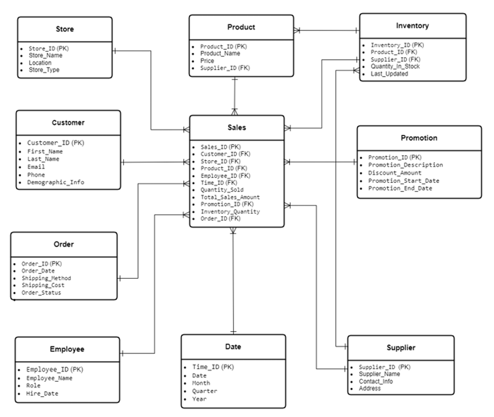
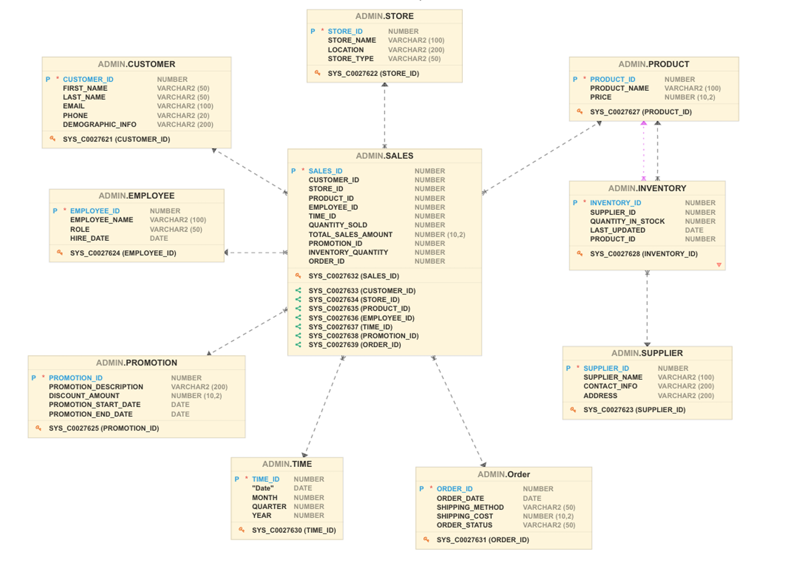
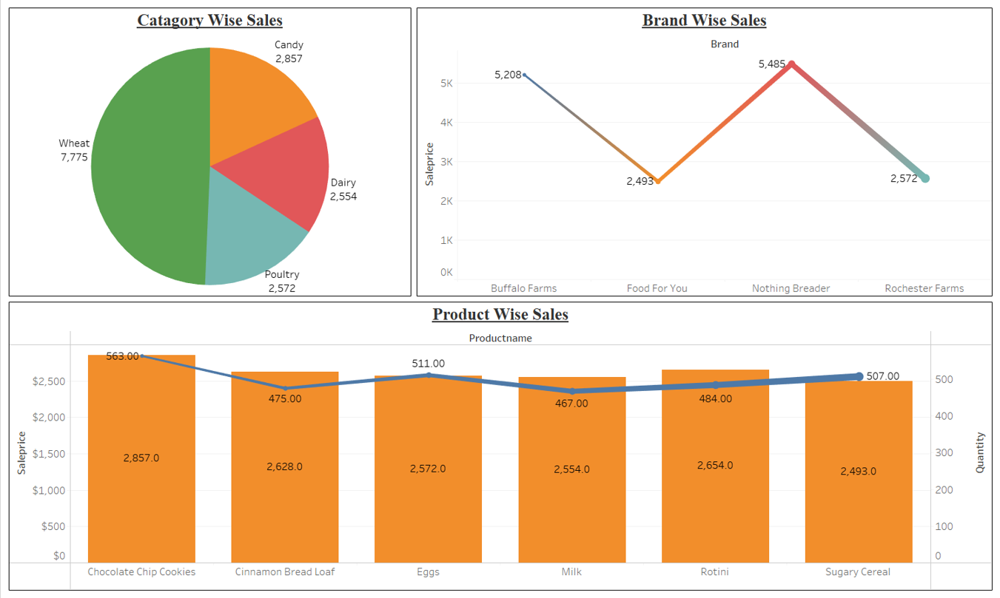

# 🛠️ ETL & Data Warehousing Project: Apache Hop + Oracle Cloud

This project demonstrates the design and implementation of a complete ETL pipeline using **Apache Hop** and **Oracle Autonomous Data Warehouse**, integrated with **Tableau** for dashboard visualization. The goal was to simulate real-world data warehousing scenarios involving dimension and fact loading, slow-changing dimensions (SCDs), and end-to-end reporting.

---

## 📌 Overview

- Created a star schema for the retail domain ("The Guac Stop").
- Built ETL pipelines in Apache Hop to load both dimension and fact tables.
- Integrated Tableau to develop interactive sales dashboards.
- Secure Oracle DB connectivity using Wallet config.

---

## 🧱 Entity Relationship Diagram (ERD)

---

## 🧩 Data Warehouse Logical Model

This reflects the star schema design implemented on Oracle Cloud.

---

## 🔄 ETL Pipeline in Apache Hop

ETL flow to load the `FACT_SALES` table with stream lookups, filters, and batch inserts.

---

## 📊 Tableau Sales Dashboard

Interactive dashboard analyzing Category, Brand, and Product-wise sales performance.

#### 📊 Dashboard Highlights:
- **🥇 Category-Wise Sales (Pie Chart):**  
  Displays the distribution of sales across major product categories.  
  🔹 *Top performer: Wheat* with the highest sales volume.  
  🔹 Enables quick understanding of category contribution to total revenue.

- **🏷️ Brand-Wise Sales (Line Chart):**  
  Trend analysis across leading brands such as Buffalo Farms, Nothing Breeder, and others.  
  🔹 Visualizes brand spikes and dips in performance.  
  🔹 Highlights brands with high product penetration and popularity.

- **📦 Product-Wise Sales (Bar + Line Combo):**  
  Dual-axis chart showing both revenue (bar) and quantity sold (line).  
  🔹 *Top product: Chocolate Chip Cookies*, both in quantity and sales.  
  🔹 Assists in identifying fast-moving vs. underperforming products.

#### 🔎 Use Cases:
- Identify which product lines drive the majority of revenue.
- Support decisions on inventory, promotions, and procurement.
- Pinpoint seasonal surges in specific product segments.

---

## 🧪 Technologies Used

- **ETL Tool**: Apache Hop
- **Data Warehouse**: Oracle Cloud ADW
- **Visualization**: Tableau
- **Languages**: SQL, PL/SQL

---

## ✅ Outcomes

- Developed practical ETL and data modeling skills.
- Automated dimension and fact table loads with stream lookups.
- Delivered insights via interactive Tableau dashboards.

---

## 👨‍💻 Author

**Poorna Chandra Ramachandra**  
🔗 [LinkedIn](www.linkedin.com/in/poorna-chandra-ramachandra-1b97791a0)  
📫 Reach out for collaboration or questions.

---

## 📄 License

MIT License. See `LICENSE` for usage rights.
